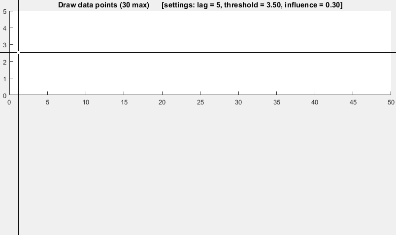

# Just another repo of Python scripts and codes


Installing packages for python 3.6

```sh
python3.6 -m pip install <package-name>
```


## Scripts

- [Port Scan](scripts/portscan.py)
- [Brute force SSH logins using paramiko](scripts/ssh-dictionary-attack.py)
- [dynamic-firmware-analysis](https://github.com/secjey/dynamic-firmware-analysis)
- [Firmware Analysis Toolkit](https://github.com/attify/firmware-analysis-toolkit)
- [The most useful python snippets](https://github.com/progrmoiz/python-snippets)

## Algorithms

- [Sort Algorithms](pySorting/README.md)
- [All Algorithms implemented in Python](https://github.com/TheAlgorithms/Python)
- [Fourier Transforms](fourier-transforms/README.md)
- [find length of sequences of identical values in a numpy array (run length encoding)](run-length-encoding/run-length-encoding.md)
- [Smoothed z-score algo (very robust thresholding algorithm)](run-length-encoding/ThresholdingAlgo.py)
- [Noise Reduction](noise-reduction/README.md)


## Machine learning

- [split dataset](machine-learning/split_dataset.py)
- [Compute Receptive Field](machine-learning/computeReceptiveField.py)


Demo of thresholding algorithm




## Great plots


