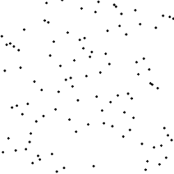

# PySorting

A Python program for different sorting algorithms

## Sorting Algorithms:

### Insertion Sort

Image Source:[wikipedia](https://en.wikipedia.org/wiki/Insertion_sort) 

A simple sorting algorithm that builds the final sorted array (or list) one item at a time. It is much less efficient on large lists than more advanced algorithms such as quicksort, heapsort, or merge sort.

__Properties__
* Data Structure: Array
* Worst case performance:	O(n^2) comparisons, swaps
* Best case performance:	O(n) comparisons, O(1) swaps
* Average case performance:	O(n^2) comparisons, swaps
* Worst-case space complexity: O(n) total, O(1) auxiliary

### Bubble sort

Image Source:[wikipedia](https://en.wikipedia.org/wiki/Bubble_sort) 

A simple sorting algorithm that repeatedly steps through the list to be sorted, compares each pair of adjacent items and swaps them if they are in the wrong order. The pass through the list is repeated until no swaps are needed, which indicates that the list is sorted.

__Properties__
* Data Structure: Array
* Worst case performance:	O(n^2)
* Best case performance:	O(n)
* Average case performance:	O(n^2)
* Worst-case space complexity: O(1) auxiliary

### Quick sort

Image Source:[wikipedia](https://en.wikipedia.org/wiki/Quicksort) 

An efficient sorting algorithm, serving as a systematic method for placing the elements of an array in order.

__Properties__
* Worst case performance	O(n^2)
* Best case performance	O(n log n)(simple partition) or O(n) (three-way partition and equal keys)
* Average case performance	O(n log n)
* Worst-case space complexity  O(n) auxiliary (naive)  O(log n) auxiliary (Sedgewick 1978)

### Selection sort

Image Source:[wikipedia](https://en.wikipedia.org/wiki/Selection_sort)  

An in-place comparison sort and its simplicity. It divides the input lists into two parts: the sublist of items already sorted, adn the sublist of items remaining to be sorted that occupy the rest of the list.

__Properties__
* Data Structure: Array
* Worst case performance:	O(n^2)
* Best case performance:	O(n^2)
* Average case performance:	O(n^2)
* Worst-case space complexity: O(n) total, O(1) auxiliary

### Shell sort

Image Source:[wikipedia](https://en.wikipedia.org/wiki/Shellsort) 

The method starts by sorting pairs of elements far apart from each other, then progressively reducing the gap between elements to be compared. Starting with far apart elements, it can move ome out-of-place elements into position faster then a simple nearest neighbor exchange.

__Properties__
* Data Structure: Array
* Worst case performance:	O(n log2 2 n)
* Best case performance:	O(n log n)
* Average case performance:	depends on gap sequence
* Worst-case space complexity: O(n) total, O(1) auxiliary

### Merge sort

Image Source:[wikipedia](https://en.wikipedia.org/wiki/Merge_sort) 

A divide and conquer sorting algorithm. Most implementations produce a stable sort, which means that the implementation preserves the input order of equal elements in the sorted output.

__Properties__
* Data Structure: Array
* Worst case performance:	O(n log n)
* Best case performance:	O(n log n) typical, O(n) natural variant
* Average case performance:	O(n log n)
* Worst-case space complexity: O(n) total, O(1) auxiliary

### Heap sort

Image Source:[wikipedia](https://en.wikipedia.org/wiki/Heapsort) 

A comparison-based sorting algorithm. It can be thought of as an improved selection sort, it divides its input into s sorted and an unsorted region, and it iteratively shrinks the unsorted region by extracting the largest element and moving that to the sorted region. 

__Properties__
* Data Structure: Array
* Worst case performance:	O(n log n)
* Best case performance:	O(n log n)
* Average case performance:	O(n log n)
* Worst-case space complexity: O(1) auxiliary

### Gnome sort

Image Source:[wikipedia](https://en.wikipedia.org/wiki/Gnome_sort) 

It is similar to insertion sort, except that moving an element to its proper place is accomplished by a series of swaps, as in bubble sort.

__Properties__
* Data Structure: Array
* Worst case performance:	O(n^2)
* Best case performance:	Ω(n)
* Average case performance:	O(n^2)
* Worst-case space complexity: O(1) auxiliary

### Cocktail sort

Image Source:[wikipedia](https://en.wikipedia.org/wiki/Cocktail_shaker_sort) 

Bidirectional bubble sort, a variation of bubble sort, it sorts in both directions on each pass through the list.

__Properties__
* Data Structure: Array
* Worst case performance:	O(n^2)
* Best case performance:	O(n)
* Average case performance:	O(n^2)
* Worst-case space complexity: O(1)

## How-To

It is compatible in both Python 2.x and Python 3.x, it runs on the standard in-build library, no external dependencies need.
