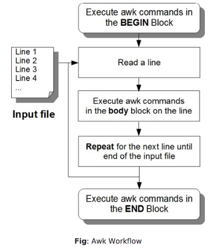

# Awk Tutorial
==============

- [Awk Syntax and Basic Commands](#sed-syntax-and-basic-commands)
- [Awk Built-in Variables](#awk-built-in-variables)
- [Awk Variables and Operators](#awk-variables-and-operators)
- [Awk Conditional Statements and Loops](#awk-conditional-statements-and-loops)
- [Awk Associative Arrays](#awk-associative-arrays)
- [Additional Awk Commands](#additional-awk-commands)
- [AWK Cheat Sheet](https://github.com/pkrumins/awk-cheat-sheet/blob/master/awk.cheat.sheet.txt)

<br>
<hr>
<br>

### Awk Syntax and Basic Commands

[[back to top](#awk-tutorial)]

Awk is a powerful languge to manipulate and process text files. It is especially helpful when the lines in a text files are in a record format, i.e., when each line (record) contains multiple fields separated by a delimiter.

#### 1. Awk Command Syntax

**Basic Awk Syntax:**

```awk
awk -Fs '/pattern/ {action}' input-file
(or)
awk -Fs '{action}' input-file
```

- **F** is the field separator. If you don't specify, it will use an empty space as field delimiter.

- The `/pattern/` and the `{action}` should be enclosed inside single quotes.

- `/pattern/` is optional, If you specify a pattern, awk will process only those records from the input-file that match the given pattern. If you don't, it will process all the records from the input-file.

- `{action}`, it can be one or multiple awk commands.

- input-file, the input file needs to be processed.

```awk
$ awk -F: '/mail/ {print $1}' /etc/passwd 
$ awk -F ":" '/mail/ {print $1}' /etc/passwd
```

- **-F:** or **-F ":"**, indicates that the field separator in the input-file is colon :.

- /mail/, awk will process only the records that contains the keyword mail.

- {print $1}, this action block contains only one awk command, that prints the 1st field of the record that matches the pattern "mail".

- /etc/passwd - input file.

You can specify awk commands in an awk script file:

```
awk -Fs -f myscript.awk input-file
```

#### 2. Awk Program Structure

A typical awk program has following three blocks: BEGIN, body and END.

- BEGIN Block (optional)

```
BEGIN {awk-commands}
```

The begin block gets executed only once at the beginning, before awk starts executing the body block for all the lines in the input file.

  - The begin block is a good place to print report headers, and initialize variables.

  - You can have one or more awk commands in the begin awk.

- Body Block

```
/pattern/ {action}
```

The body block gets executed once for every line in the input file. i.e., the input file has 10 records, the commands in the body block will be executed 10 tme.

- END Block

```
END {awk-commands}
```

The end block gets executed only once at the end, after awk completes executing the body block for all the lines in the input-file.

  - The end block is a good place to print a report footer and do any clean-up activities.

  - You can have one or more awk commands in the end block.



Image Source: Sed and Awk 101 Hacks

For example:

```
$ awk 'BEGIN { FS=":"; print "---header---"} /mail/ {print $1} END { print "---footer---"}' /etc/passwd 
```

You can also execute the command line from script file:

```
$ vi test.awk
BEGIN { 
    FS=":";
    print "---header---"
} 
/mail/ {
    print $1
} 
END { 
    print "---footer---"
}
```

```
$ awk -f test.awk /etc/passwd
```

#### 3. Print Command

By default, the awk print command prints the full record, it is equivalent to `cat` command.

```
$ awk '{print}' titanic.txt

# PassengerId Survived Pclass Name Sex Age SibSp Parch Ticket Fare Cabin Embarked

# show all lists
awk '{print $0}' titanic.txt

# show name and age
awk '{print $4, $6}' titanic.txt

# field number 4 indicates: Name
$ awk '{print $4 }' titanic.txt
```

#### 4. Pattern Matching

```awk
# print the names and sex
$ awk '/male/ {print $4, $5}' titanic.txt

# print Id from 10 - 19 name and sex
awk '/^1/ {print $4,"\t", $5}' titanic.txt 

# filter the name including William
awk '/William/{print $0}' titanic.txt

# filter the age <= 30
awk '$6<=30{print $0}' titanic.txt

# regex, start from 10 to 13
awk '/^1[0-3]/{print $0}' titanic.txt
```

<br>
<hr>
<br>

### Awk Built-in Variables

[[back to top](#awk-tutorial)]

#### 1. FS - Input Field Separator

The default field separator recognized by awk is space.

```awk
$ awk -F ',' '{print $1, $2}' items.txt

$ awk 'BEGIN {FS=","} {print $1, $2}' items.txt

$ awk 'BEGIN {FS=","; \
print "--------\nID\tItem\n--------"} \
{print $1,"\t",$2} \
END {print "--------"}' items.txt
```

When a file contains different field separators, you can specify multiple field separators using a regular experession. 

```awk
$ awk 'BEGIN {FS="[,:@]"} {print $1, $2, $5}' items.txt
```

#### 2. OFS - Output Field Separator

OFS is printed between consecutive fields in the output. By default, awk prints OFS with space.

```awk
$ awk -F ',' '{print $1, ":", $2}' items.txt

$ awk -F ',' 'BEGIN { OFS=":"} { print $2, $3 }' items.txt
```

#### 3. RS - Record Separator

The default record separator used by awk is new line.

```awk
$ awk -F ',' 'BEGIN { RS="@"} { print }' items.txt

$ awk -F ',' 'BEGIN { RS="@"} { print $1 }' items.txt
```

#### 4. ORS - Output Record Separator

```awk
$ awk 'BEGIN {FS="[,:@]"; ORS="\n---\n"} {print $1, $2, $5}' items.txt

$ awk 'BEGIN {FS="[,:@]"; OFS="\n"; ORS="\n---\n"} {print $1, $2, $5}' items.txt
```

#### 5. NR - Number of Records

When NR is used inside the loop, this gives the line number. When used in the END block, this gives the total number of records in the file.

```awk
$ awk 'BEGIN {FS=","} \
{print "Item Id of record number", NR, "is", $1;} \
END {print "Total number of records:", NR}' items.txt
```

#### 6. FILENAME - Current File Name

This will give you the name of the file Awk is currently processing. 

FILENAME inside the BEGIN block will return empty value "",as the BEGIN block is for the whole awk program, and not for any specific file.

```awk
$ awk 'BEGIN {FS=","} {print "Item:", $2; print "Filename:", FILENAME}' items.txt

# it will return empty value in this example
$ echo "John Smith" | awk '{print "Last name:", $2; \
print "Filename:", FILENAME}'
```

#### 7. FNR - File "Number of Record"

When you have two input files, NR keeps growing between multiple files. When the body block starts processing the 2nd file, NR will not be reset to 1, instead it will continue from the last NR number value of the previous file.

```awk
# copy the file to test
$ cp items.txt items-1.txt

# each file has 5 records each, NR continued incrementing after the 1st file is processed.
$ awk 'BEGIN {FS=","} \
{print FILENAME ": Record Number", NR, "is", $1} \
END {print "Total number of records:",NR}' items.txt items-1.txt

# FNR will give you record number within the current file. 
# When awk starts the bdoy block 2nd file, FNR will start from 1 again
$ awk 'BEGIN {FS=","} \
{print FILENAME ": Record Number", FNR, "is", $1} \
END {print "Total number of records:",NR}' items.txt items-1.txt
```

<br>
<hr>
<br>

### Awk Variables and Operators

[[back to top](#awk-tutorial)]

#### 1. Variables

```awk
$ cat variables.awk
BEGIN {
    FS="[,:@]"
    total=0;
}
{
    print $2 "'s price is: " $4;
    total=total+$4
}
END {
    print "---\nTotal price = $"total;
}

$ awk -f variables.awk items.txt
```

#### 2. Operators

- **+**: The number (returns the number itself)
- **-**: Negate the number
- **++**: Auto Increment
- **--**: Auto Decrement

i.e., `++$2`, `$++`

Pre means it will add ++ (or --) before the variable name. This will first increase (or decrease) the value of the variable by one, and then execute the rest of the statement in which it is used.

Post means it will add ++ (or --) after the variable name. This will first execute the containing statement and then increase (or decrease) the value of the variable by one.

```awk
# print number of shell users
$ awk -F ':' '$NF ~ /\/bin\/bash/ { n++ }; END { print n }' /etc/passwd

# print all the even numbered lines
$ awk 'NR %2 == 0' items.txt

# print the average age
$ awk '{age+=$6};END{print age/(NR-1)}' titanic.txt

# find the minimal value
$ awk 'NR==2{min=$10}{if($10<min) {min=$10};} END {print min}' titanic.txt 

# output the ID and age to a file
$ awk '{print $1, $6}' titanic.txt > pID_age.txt
```

- Regular Expression Operators

**~** Match operator (not a full match)

**==** Full Match

**!~** No Match operator

```awk
$ awk -F "," '$2 ~ "iPhone"' items.txt
$ awk -F "," '$2 == "iPhone"' items.txt
```

<br>
<hr>
<br>

### Awk Conditional Statements and Loops

[[back to top](#awk-tutorial)]

#### 1. If Statement

```
if (conditional-expression)
{
	action1;
	action2;
}
```

```awk
$ awk 'BEGIN {FS="[,:@]"} \
{if (($4 >= 300 && $4 <= 800) && ($5 <= 10)) \
print "Only", $5, "qty of",$2, "is available";}' items.txt
```

```
if (conditional-expression)
    action1
else
    action2
```

Ternary Operator Syntax:

```
conditional-expression ? action1 : action2 ;
```

```awk
# print concatenated pairs of records
$ awk 'ORS=NR%2? ",":"\n"' items.txt
```

#### 2. While Loop

```awk
$ awk 'BEGIN \
{ while (count++<50) string = string "x"; print string }'
```

```awk
$ awk 'BEGIN{
count=1;
do
print "This gets printed at least once";
while(count!=1)
}'
```

#### 3. For Loop

```awk
$ echo "1 2 3 4" | awk \
'{for (i=1; i <= NF; i++) total = total+$i }; \
END { print total }'
```
- Continue Statement

```awk
$ awk 'BEGIN { x=1;
    while(x<=10) {
        if (x==5) {
            x++;
            continue;
        }
        print "Value of x", x; x++;
    }
}'
```

- Exit Statement

```awk
$ awk 'BEGIN { x=1;
    while(x<=10) {
        if (x==5) {
            x++;
            exit;
        }
        print "Value of x", x; x++;
    }
}'
```

<br>
<hr>
<br>

### Awk Associative Arrays

[[back to top](#awk-tutorial)]

#### 1. Assigning Array Elements

```awk
$ cat arrays.awk
BEGIN {
  item[101]="iPhone 6";
  item[102]="MaccBook Air";
  item["na"]="Not Available";

  for (x in item)
    print item[x];
}

$ awk -f arrays.awk 
```

#### 2. Multi Dimensional Array

```awk
$ cat multi-array.awk
BEGIN {
  item["1,1"]=10;
  item["1,2"]=20;
  item["2,1"]=30;
  item["2,2"]=40;

  for (x in item)
    print item[x];
}

$ awk -f multi-array.awk
```
<br>
<hr>
<br>

### Additional Awk Commands

[[back to top](#awk-tutorial)]

#### 1. printf

```awk
# new line
$ awk 'BEGIN { printf "Line 1\nLine 2\n" }'
# tab
$ awk 'BEGIN \
{ printf "Field 1\tFiled 2\tField 3\tFiled 4\n"}'
# vertical tab
$ awk 'BEGIN \
{ printf "Field 1\vFiled 2\vField 3\vFiled 4\n"}'
# backspace
$ awk 'BEGIN \
{ printf "Field 1\bFiled 2\bField 3\bFiled 4\n"}'
# carriage return
$ awk 'BEGIN \
{ printf "Field 1\rFiled 2\rField 3\rFiled 4\n"}'
```

#### 2. Argument Processing

```awk
$ cat arguments.awk
BEGIN {
  print "ARGC=",ARGC
  for (i = 0; i < ARGC; i++)
    print ARGV[i]
}

$ awk -f arguments.awk arg1 arg2 arg3 arg4
```

<br>
<hr>
<br>

### Reference

* [Sed-and-Awk-101-Hacks](https://www.yumpu.com/en/document/view/25827537/sed-and-awk-101-hacks)
